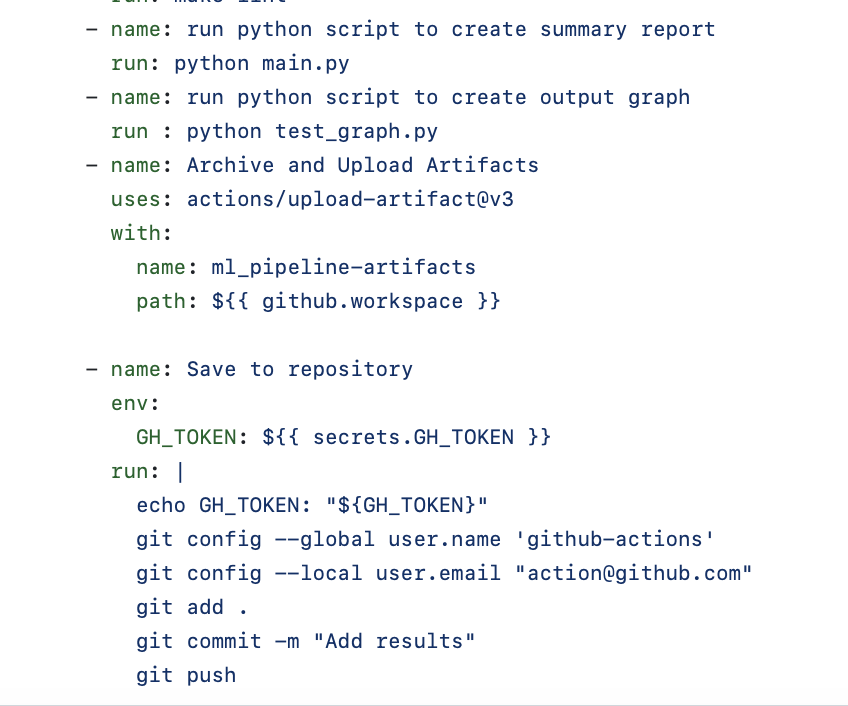

## CRUD Operations Overview

This repository is a derivative of an original SQLite lab, adapted to explore the fascinating world of global university rankings. The data is drawn from a comprehensive CSV file detailing university rankings worldwide, which has been imported into a SQLite database named `ranking.db` under the table `universities`.

CRUD is an acronym for the four fundamental operations for persistent storage interaction:
- **Create**: Add new entries
- **Read**: Retrieve existing information
- **Update**: Modify existing entries
- **Delete**: Remove unwanted data

These operations form the backbone of data management within this project's database.

## Code Structure

The repository includes various Python scripts that perform CRUD operations:

- `read.py`: Demonstrates data retrieval techniques.
- `create.py`: Shows how to insert new data.
- `update.py`: Alters existing data entries.
- `delete.py`: Removes data from the database.

## Automation with Makefile

- `install`: Set up the project by installing necessary dependencies listed in `requirements.txt`.
- `test`: Run automated tests to validate the correctness of CRUD operations.
- `format`: Standardize code formatting using Black for Python.
- `lint`: Analyze the codebase for potential errors using Ruff.

## Continuous Integration and Continuous Deployment (CI/CD)

Utilizing GitHub Actions, this project ensures each push or pull request goes through a CI/CD pipeline, automating tests, formatting, linting, and other checks. You can view the status of these workflows through badges in this README.

## Data Visualization

Leveraging the power of pandas and SQL queries, the project includes a visualization script that generates insights into the correlation between a university's rank and its industry income score.

## Getting Started

To clone and run this project locally:

```bash
git clone https://github.com/your-username/repository-name.git
cd repository-name
make install
make test


